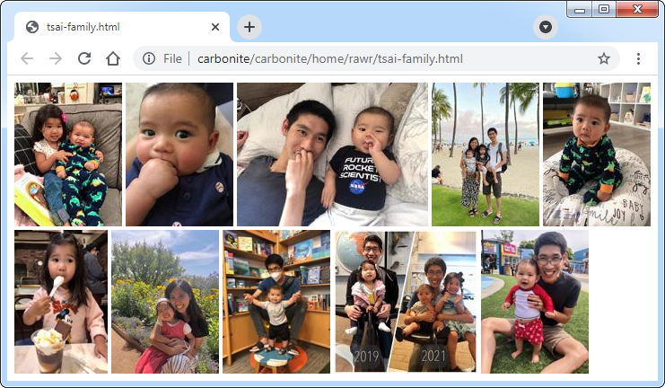

# Static Gallery Generator

This program generates a static `.html` file containing previews of all images
and videos in a directory. The previews are embedded within the HTML itself
using the [data URI scheme](https://en.wikipedia.org/wiki/Data_URI_scheme)
to avoid generating separate preview files for every item in the gallery.
Each preview is a link to the original media file.

Example of rendered HTML:


Example of encoded HTML:
```html
<html data-magic="generate-gallery" data-gallery=...>
<body>
<a href="tsai-family/IMG_1362.JPG" target="_blank"></a>
<a href="tsai-family/IMG_1360.JPG" target="_blank"></a>
<a href="tsai-family/IMG_1379.JPG" target="_blank"></a>
<a href="tsai-family/IMG_1425.JPG" target="_blank"></a>
<a href="tsai-family/IMG_1464.JPG" target="_blank"></a>
<a href="tsai-family/IMG_1463.JPG" target="_blank"></a>
<a href="tsai-family/IMG_1492.JPG" target="_blank"></a>
<a href="tsai-family/IMG_1494.JPG" target="_blank"></a>
<a href="tsai-family/IMG_1495.JPG" target="_blank"></a>
<a href="tsai-family/IMG_1538.JPG" target="_blank"></a>
</body>
</html>
```

## Usage 

The tool can be installed with:
```
$ go install github.com/dsnet/generate-gallery@latest
```

The tool can be invoked as follows, where the program is passed a directory
containing image and video files to process:
```
$ generate-gallery $DIR
```

The tool reads and decodes all image and video files in the directory and
produces a downsampled preview image for each media item in the gallery.
It emits a `$DIR.html` file that is the statically generated gallery.
If a previously generated `.html` file already exists,
it is parsed and any preview images within it are reused
before being overwitten by the newly generated `.html` file.
To prevent reuse of previously generated `.html` files,
simply remove the `.html` file before running the tool.

## Supported formats

The set of supported formats are based on those that are commonly supported
by most modern browsers:

* [JPEG](https://en.wikipedia.org/wiki/JPEG)
* [PNG](https://en.wikipedia.org/wiki/Portable_Network_Graphics)
* [GIF](https://en.wikipedia.org/wiki/GIF)
* [WebP](https://en.wikipedia.org/wiki/WebP)
* [WebM](https://en.wikipedia.org/wiki/WebM)
* [MP4](https://en.wikipedia.org/wiki/MPEG-4_Part_14)

Regarding the list above, there are some caveats:

* Reading metadata for creation date is only supported for JPEG and MP4.

* Decoding of animated WebP images is only supported to the degree
  that they are supported by `ffmpeg`.
  As of 2021-07-04, animated WebP images are not supported
  (see https://trac.ffmpeg.org/ticket/4907).

* The MP4 format is a container for video and audio streams that can be encoded
  with a number of various codecs. A valid MP4 file may not be playable in
  a given browser because it lacks support for the codecs used.
  For maximum compatibility, we recommend using
  [H.264](https://en.wikipedia.org/wiki/Advanced_Video_Coding)
  for the video encoding and
  [AAC](https://en.wikipedia.org/wiki/Advanced_Audio_Coding)
  for the audio encoding.

  An existing MP4 file can be transcoded for better compatibility with:
  ```
  $ ffmpeg -i $IN_FILE -vcodec h264 -acodec aac $OUT_FILE
  ```

## Binary dependencies

This program invokes `ffmpeg` and `ffprobe` in order to handle the
GIF, WebP, WebM, and MP4 file formats. In particular, `ffmpeg` needs to support
encoding of animated WebP images for previews of movie files.
Support for encoding WebP can be checked by running:

```
$ ffmpeg -v quiet -codecs | grep webp
 DEVILS webp                 WebP (encoders: libwebp_anim libwebp )
```

The `E` flag in `DEVILS` indicates that encoder support is available for WebP.

If `ffmpeg` is not available or the currently installed version
does not support encoding WebP images, then you can download the latest
version of `ffmpeg` as a static binary from https://ffmpeg.org/download.html.